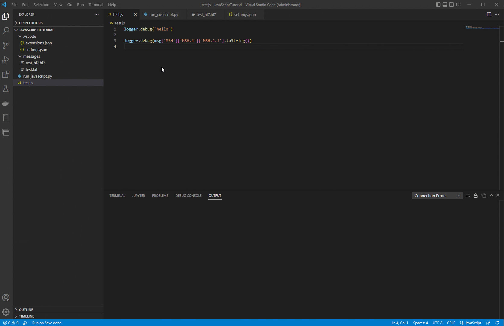

# Mirth VSCode JavaScript Runner

> IMPORTANT: This only works on localhosted mirth instances

This project gives us the ability to write JavaScript within VSCode and automatically run the channel after the file has been saved. It will then take the logs printed out and display them in the Run On Save Output.

How to get started:
1. Download this repository
2. Create your test js file within the repository folder.
3. Create channel within Mirth and edit the transformer to be an external script.
4. Add the location of the test js file to the external script transformer.
5. Create your test message on your local machine.
6. Within VS Code, download the Run On Save extension by emeraldwalk
7. Open Command Palette (Ctrl + Shift + P)
8. Search for "Preferences: Open Workspace Settings (JSON)"
9. Add the following json
```
{
    "emeraldwalk.runonsave": {
        "commands": [
            {
                "match": "*.js",
                "isAsync": true,
                "cmd": "py run_javascript.py -cid {channel_id} -msg {message_file_location}"
            }
        ]
    }
}
```
- replace {channel_id} with the channel id you intead to deploy and send a message to
- replace {message_file_location} with the file location with the message you want to send
10. Write your script within the test js file and save and watch it log out the logs for your channel within the Run On Save Output view.

## In Action
